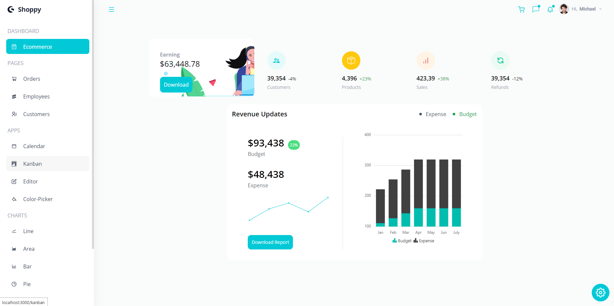

<h1 align="center">React Admin Dashboard</h1>

<p align="center">Creating a Admin Dashboard using Next.js (with React and Typescript), Tailwind and Syncfusion.</p>

## About
In this project I used and learned about [Syncfusion](https://www.syncfusion.com) which is a awesome UI component suite, providing a lot of components such as like Kanbans, Calendar, Editors, ColorPickers, etc.

Also used [TailwindCSS](https://tailwindcss.com) which is a powerful tool to stylize your HTML with classes and the CSS bundle is always what you used so, in that way, you have the smallest bundle size possible!

## Credits
The project was developed following the tutorial provided by [JavaScript Mastery](https://www.youtube.com/watch?v=jx5hdo50a2M) which has awesome content about React and JavaScript in general.

The original repository is [right here](https://github.com/adrianhajdin/project_syncfusion_dashboard)

## Run the project
```bash
# Install dependencies
npm install
# OR
yarn install

# Run development script
npm run dev
# OR
yarn dev

# Run production script
npm run build && npm start
# OR
yarn build && yarn start
```